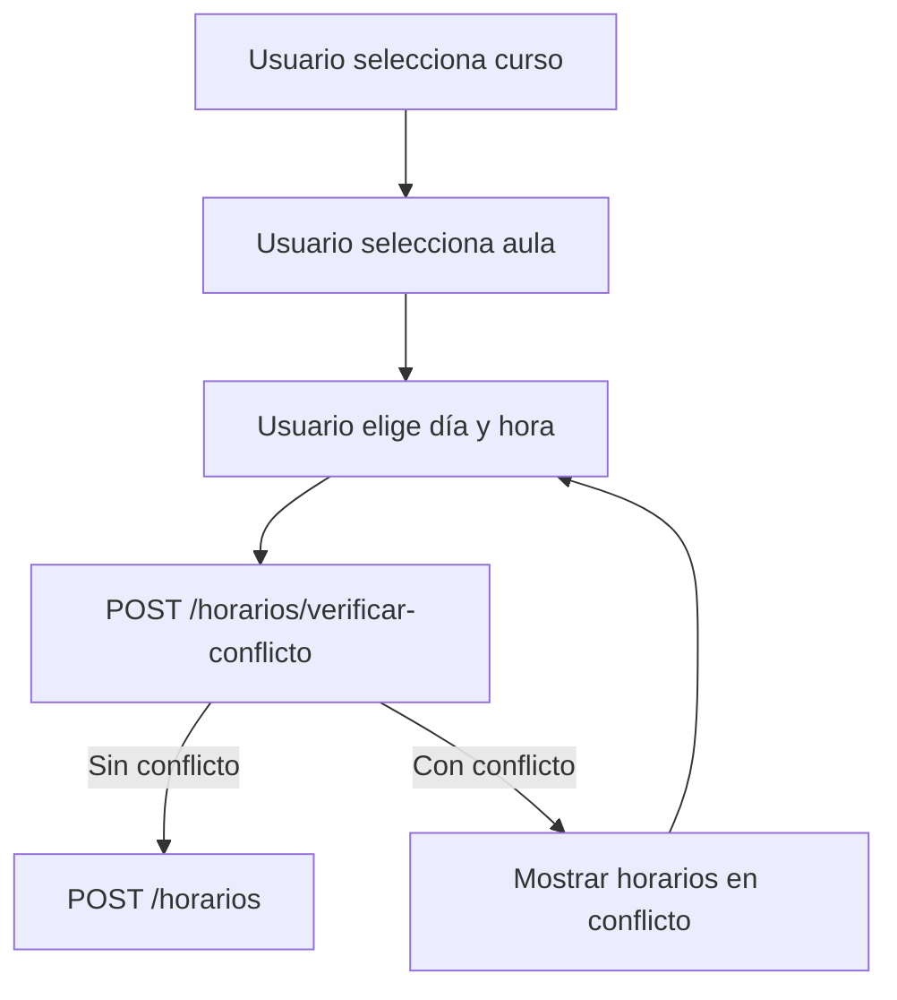

# API de Aulas y Horarios

Documentación de endpoints para gestión de aulas físicas y horarios de cursos.

**Base URL:** `http://localhost:3000/api`
**Autenticación:** Cookie `token` (JWT httpOnly)

---

## Índice

- [Reglas de Negocio y Restricciones](#reglas-de-negocio-y-restricciones)
- [Aulas](#aulas)
- [Horarios](#horarios)
- [Tipos y Constantes](#tipos-y-constantes)
- [Flujos de Trabajo Recomendados](#flujos-de-trabajo-recomendados)

---

## Reglas de Negocio y Restricciones

### Aulas

#### Relación con Sucursales
- Cada aula **pertenece a una sucursal** específica
- La sucursal debe existir y pertenecer a la misma empresa del usuario autenticado
- Al listar aulas, se incluye el nombre de la sucursal (`sucursalNombre`)

#### Capacidad Máxima
- Es un número entero >= 0
- Si no se especifica, el valor por defecto es `0` (sin límite definido)
- Este valor puede ser sobrescrito a nivel de horario si se necesita limitar cupos

#### Activación/Desactivación (Soft Delete)
- Las aulas **no se eliminan físicamente**, se desactivan (`activo: false`)
- Un aula desactivada:
  - No aparece en listados con filtro `activo=true`
  - **Sus horarios siguen existiendo** pero deberían considerarse inválidos
  - Se puede reactivar en cualquier momento
- Antes de desactivar un aula, se recomienda verificar si tiene horarios activos (`horariosActivos`)

#### Validaciones
| Campo | Restricción |
|-------|-------------|
| `nombre` | Obligatorio, 1-100 caracteres |
| `descripcion` | Opcional, máximo 500 caracteres |
| `capacidadMaxima` | Entero >= 0 |
| `sucursalId` | Debe existir y pertenecer a la empresa |

---

### Horarios

#### Modalidades: Virtual vs Presencial

| Modalidad | `aulaId` | Descripción |
|-----------|----------|-------------|
| `virtual` | Opcional (puede ser `null`) | Clase en línea, no requiere espacio físico |
| `presencial` | **OBLIGATORIO** | Clase presencial, debe asignarse un aula |

**Regla crítica:** Si `modalidad = "presencial"` y no se envía `aulaId`, el backend retorna error 400.

#### Sistema de Detección de Conflictos

El sistema **verifica automáticamente** que no existan superposiciones de horarios en la misma aula.

**¿Qué es un conflicto?**
Dos horarios entran en conflicto cuando:
1. Están en la **misma aula** (`aulaId`)
2. Están en el **mismo día** (`diaSemana`)
3. Sus rangos de tiempo **se superponen**

**Ejemplo de conflicto:**
```
Horario existente: Lunes 08:00-10:00 en Aula 101
Nuevo horario:     Lunes 09:00-11:00 en Aula 101
→ CONFLICTO (se superponen de 09:00 a 10:00)
```

**Ejemplo sin conflicto:**
```
Horario existente: Lunes 08:00-10:00 en Aula 101
Nuevo horario:     Lunes 10:00-12:00 en Aula 101
→ OK (uno termina exactamente cuando empieza el otro)
```

**Cuándo se verifica:**
- Al **crear** un horario presencial → automático
- Al **actualizar** un horario presencial → automático
- Manualmente con `POST /horarios/verificar-conflicto` → antes de guardar

#### Días de la Semana (ISO 8601)

El sistema usa el estándar ISO 8601 donde la semana comienza en Lunes:

| Valor | Día | Uso común |
|-------|-----|-----------|
| 1 | Lunes | Día laboral |
| 2 | Martes | Día laboral |
| 3 | Miércoles | Día laboral |
| 4 | Jueves | Día laboral |
| 5 | Viernes | Día laboral |
| 6 | Sábado | Fin de semana |
| 7 | Domingo | Fin de semana |

**Nota:** El backend incluye `diaSemanaTexto` en las respuestas para mostrar el nombre en español.

#### Formato de Hora

- Formato: `HH:mm` (24 horas)
- Ejemplos válidos: `"08:00"`, `"14:30"`, `"23:45"`
- Ejemplos inválidos: `"8:00"` (debe ser `"08:00"`), `"2:30 PM"`, `"14:30:00"`

#### Duración

- Se expresa en **minutos**
- Mínimo: 1 minuto
- Máximo: 720 minutos (12 horas)
- El campo `horaFin` se **calcula automáticamente**: `horaInicio + duracionMinutos`

#### Capacidad Máxima del Horario

- Es un **override opcional** de la capacidad del aula
- Si se omite, se usa la capacidad del aula asignada
- Útil cuando un curso tiene menos cupos que la capacidad física del aula
- Puede ser `null` para usar el valor del aula

#### Relación Curso-Horario

- Un curso puede tener **múltiples horarios** (ej: Lunes y Miércoles)
- Cada horario pertenece a **un solo curso**
- El curso debe existir y pertenecer a la misma empresa

#### Validaciones de Horario

| Campo | Restricción |
|-------|-------------|
| `cursoId` | Obligatorio, debe existir |
| `aulaId` | Obligatorio si `modalidad = "presencial"` |
| `modalidad` | Solo `"virtual"` o `"presencial"` |
| `diaSemana` | Entero entre 1 y 7 |
| `horaInicio` | Formato `HH:mm` |
| `duracionMinutos` | Entero entre 1 y 720 |
| `capacidadMaxima` | Entero >= 0 o `null` |

---

### Multi-tenancy

- Todos los recursos están **aislados por empresa** (`empresaId`)
- El `empresaId` se obtiene automáticamente del token JWT
- Un usuario solo puede ver/modificar aulas y horarios de su propia empresa
- No es posible asignar un aula de otra empresa a un curso propio

---

## Flujos de Trabajo Recomendados

### Crear un horario presencial (con validación previa)



**Código de ejemplo:**

```typescript
// 1. Verificar disponibilidad
const verificacion = await api.post('/horarios/verificar-conflicto', {
  aulaId: '1',
  diaSemana: 1,
  horaInicio: '08:00',
  duracionMinutos: 120
});

if (verificacion.data.tieneConflicto) {
  // Mostrar conflictos al usuario
  console.log('Conflictos encontrados:', verificacion.data.conflictos);
  return;
}

// 2. Crear horario si no hay conflicto
const horario = await api.post('/horarios', {
  cursoId: '5',
  aulaId: '1',
  modalidad: 'presencial',
  diaSemana: 1,
  horaInicio: '08:00',
  duracionMinutos: 120
});
```

### Mostrar vista semanal de un aula

Útil para un calendario/grilla de ocupación:

```typescript
// Obtener todos los horarios del aula organizados por día
const { data } = await api.get('/horarios/aula/1');

// data.horariosPorDia tiene la estructura:
// {
//   "1": [{ cursoNombre: "Matemáticas", horaInicio: "08:00", ... }],
//   "2": [{ cursoNombre: "Física", horaInicio: "10:00", ... }],
//   ...
// }

// Renderizar en un componente de calendario
Object.entries(data.horariosPorDia).forEach(([dia, horarios]) => {
  console.log(`Día ${dia}:`, horarios);
});
```

### Actualizar horario con verificación de conflicto

Al editar, usar `excludeHorarioId` para no comparar consigo mismo:

```typescript
// Verificar que el nuevo horario no colisione (excluyendo el actual)
const verificacion = await api.post('/horarios/verificar-conflicto', {
  aulaId: '1',
  diaSemana: 3,  // Nuevo día
  horaInicio: '14:00',  // Nueva hora
  duracionMinutos: 90,
  excludeHorarioId: '5'  // ID del horario que estamos editando
});

if (!verificacion.data.tieneConflicto) {
  await api.put('/horarios/5', {
    diaSemana: 3,
    horaInicio: '14:00',
    duracionMinutos: 90
  });
}
```

### Cambiar de modalidad presencial a virtual

```typescript
// Al cambiar a virtual, el aula se puede quitar
await api.put('/horarios/5', {
  modalidad: 'virtual',
  aulaId: null  // Ya no necesita aula
});
```

### Cambiar de modalidad virtual a presencial

```typescript
// Al cambiar a presencial, DEBE incluir aulaId
await api.put('/horarios/5', {
  modalidad: 'presencial',
  aulaId: '1'  // Obligatorio
});
```

---

## Aulas

### Listar aulas

```http
GET /aulas
```

**Query Parameters:**

| Parámetro | Tipo | Default | Descripción |
|-----------|------|---------|-------------|
| `page` | number | 1 | Número de página |
| `pageSize` | number | 10 | Tamaño de página (máx 100) |
| `sucursalId` | string | - | Filtrar por sucursal |
| `q` | string | - | Búsqueda por nombre |
| `activo` | boolean | - | Filtrar por estado |

**Response 200:**

```json
{
  "success": true,
  "data": [
    {
      "id": "1",
      "empresaId": "1",
      "sucursalId": "1",
      "nombre": "Aula 101",
      "capacidadMaxima": 30,
      "descripcion": "Aula equipada con proyector",
      "activo": true,
      "creadoEn": "2024-01-15T10:00:00.000Z",
      "actualizadoEn": "2024-01-15T10:00:00.000Z",
      "sucursalNombre": "Sede Central",
      "horariosActivos": 5
    }
  ],
  "pagination": {
    "page": 1,
    "pageSize": 10,
    "total": 25,
    "totalPages": 3
  },
  "message": "Aulas obtenidas exitosamente"
}
```

---

### Obtener aula

```http
GET /aulas/:id
```

**Response 200:**

```json
{
  "success": true,
  "data": {
    "id": "1",
    "empresaId": "1",
    "sucursalId": "1",
    "nombre": "Aula 101",
    "capacidadMaxima": 30,
    "descripcion": "Aula equipada con proyector y pizarra digital",
    "activo": true,
    "creadoEn": "2024-01-15T10:00:00.000Z",
    "actualizadoEn": "2024-01-15T10:00:00.000Z",
    "sucursalNombre": "Sede Central",
    "horariosActivos": 5
  }
}
```

**Response 404:**

```json
{
  "success": false,
  "error": "El aula no existe"
}
```

---

### Crear aula

```http
POST /aulas
```

**Request Body:**

```json
{
  "sucursalId": "1",
  "nombre": "Aula 101",
  "capacidadMaxima": 30,
  "descripcion": "Aula equipada con proyector y pizarra digital"
}
```

| Campo | Tipo | Requerido | Descripción |
|-------|------|-----------|-------------|
| `sucursalId` | string | Sí | ID de la sucursal |
| `nombre` | string | Sí | Nombre del aula (1-100 caracteres) |
| `capacidadMaxima` | number | No | Capacidad máxima (default: 0) |
| `descripcion` | string | No | Descripción (máx 500 caracteres) |

**Response 201:**

```json
{
  "success": true,
  "message": "Aula creada exitosamente",
  "data": {
    "id": "1",
    "empresaId": "1",
    "sucursalId": "1",
    "nombre": "Aula 101",
    "capacidadMaxima": 30,
    "descripcion": "Aula equipada con proyector y pizarra digital",
    "activo": true,
    "creadoEn": "2024-01-15T10:00:00.000Z",
    "actualizadoEn": "2024-01-15T10:00:00.000Z"
  }
}
```

---

### Actualizar aula

```http
PUT /aulas/:id
```

**Request Body:**

```json
{
  "nombre": "Aula 101-A",
  "capacidadMaxima": 35,
  "descripcion": "Aula renovada con nuevo equipamiento"
}
```

| Campo | Tipo | Requerido | Descripción |
|-------|------|-----------|-------------|
| `nombre` | string | No | Nuevo nombre (1-100 caracteres) |
| `capacidadMaxima` | number | No | Nueva capacidad |
| `descripcion` | string \| null | No | Nueva descripción (null para eliminar) |

**Response 200:**

```json
{
  "success": true,
  "message": "Aula actualizada exitosamente",
  "data": { ... }
}
```

---

### Activar aula

```http
PATCH /aulas/:id/activar
```

**Response 200:**

```json
{
  "success": true,
  "message": "Aula activada exitosamente",
  "data": { ... }
}
```

---

### Desactivar aula

```http
PATCH /aulas/:id/desactivar
```

**Response 200:**

```json
{
  "success": true,
  "message": "Aula desactivada exitosamente",
  "data": { ... }
}
```

---

## Horarios

### Listar horarios

```http
GET /horarios
```

**Query Parameters:**

| Parámetro | Tipo | Default | Descripción |
|-----------|------|---------|-------------|
| `page` | number | 1 | Número de página |
| `pageSize` | number | 10 | Tamaño de página (máx 100) |
| `cursoId` | string | - | Filtrar por curso |
| `aulaId` | string | - | Filtrar por aula |
| `diaSemana` | number | - | Filtrar por día (1-7) |
| `modalidad` | string | - | `virtual` o `presencial` |
| `activo` | boolean | - | Filtrar por estado |

**Response 200:**

```json
{
  "success": true,
  "data": [
    {
      "id": "1",
      "empresaId": "1",
      "cursoId": "5",
      "aulaId": "1",
      "modalidad": "presencial",
      "diaSemana": 1,
      "diaSemanaTexto": "Lunes",
      "horaInicio": "08:00",
      "horaFin": "10:00",
      "duracionMinutos": 120,
      "capacidadMaxima": 25,
      "activo": true,
      "creadoEn": "2024-01-15T10:00:00.000Z",
      "actualizadoEn": "2024-01-15T10:00:00.000Z",
      "cursoNombre": "Matemáticas Avanzadas",
      "aulaNombre": "Aula 101",
      "aulaCapacidad": 30
    }
  ],
  "pagination": { ... },
  "message": "Horarios obtenidos exitosamente"
}
```

---

### Obtener horario

```http
GET /horarios/:id
```

**Response 200:**

```json
{
  "success": true,
  "data": {
    "id": "1",
    "empresaId": "1",
    "cursoId": "5",
    "aulaId": "1",
    "modalidad": "presencial",
    "diaSemana": 1,
    "diaSemanaTexto": "Lunes",
    "horaInicio": "08:00",
    "horaFin": "10:00",
    "duracionMinutos": 120,
    "capacidadMaxima": 25,
    "activo": true,
    "cursoNombre": "Matemáticas Avanzadas",
    "aulaNombre": "Aula 101",
    "aulaCapacidad": 30
  }
}
```

---

### Crear horario

```http
POST /horarios
```

**Request Body:**

```json
{
  "cursoId": "5",
  "aulaId": "1",
  "modalidad": "presencial",
  "diaSemana": 1,
  "horaInicio": "08:00",
  "duracionMinutos": 120,
  "capacidadMaxima": 25
}
```

| Campo | Tipo | Requerido | Descripción |
|-------|------|-----------|-------------|
| `cursoId` | string | Sí | ID del curso |
| `aulaId` | string | Condicional | **Obligatorio** si modalidad es `presencial` |
| `modalidad` | string | Sí | `virtual` o `presencial` |
| `diaSemana` | number | Sí | 1=Lunes, 2=Martes, ..., 7=Domingo |
| `horaInicio` | string | Sí | Formato `HH:mm` (24 horas) |
| `duracionMinutos` | number | Sí | Duración en minutos (1-720) |
| `capacidadMaxima` | number | No | Override de capacidad del aula |

**Response 201:**

```json
{
  "success": true,
  "message": "Horario creado exitosamente",
  "data": { ... }
}
```

**Response 409 (Conflicto):**

```json
{
  "success": false,
  "error": "Conflicto de horario: El aula ya está ocupada en ese horario"
}
```

---

### Actualizar horario

```http
PUT /horarios/:id
```

**Request Body:**

```json
{
  "diaSemana": 3,
  "horaInicio": "14:00",
  "duracionMinutos": 90
}
```

| Campo | Tipo | Requerido | Descripción |
|-------|------|-----------|-------------|
| `aulaId` | string \| null | No | Nueva aula (null para virtual) |
| `modalidad` | string | No | `virtual` o `presencial` |
| `diaSemana` | number | No | Nuevo día (1-7) |
| `horaInicio` | string | No | Nueva hora `HH:mm` |
| `duracionMinutos` | number | No | Nueva duración |
| `capacidadMaxima` | number \| null | No | Nueva capacidad |

**Response 200:**

```json
{
  "success": true,
  "message": "Horario actualizado exitosamente",
  "data": { ... }
}
```

---

### Eliminar horario

```http
DELETE /horarios/:id
```

**Response 200:**

```json
{
  "success": true,
  "message": "Horario eliminado exitosamente"
}
```

---

### Listar horarios de un curso

```http
GET /horarios/curso/:cursoId
```

**Response 200:**

```json
{
  "success": true,
  "data": [
    {
      "id": "1",
      "diaSemana": 1,
      "diaSemanaTexto": "Lunes",
      "horaInicio": "08:00",
      "horaFin": "10:00",
      "modalidad": "presencial",
      "aulaNombre": "Aula 101"
    },
    {
      "id": "2",
      "diaSemana": 3,
      "diaSemanaTexto": "Miércoles",
      "horaInicio": "08:00",
      "horaFin": "10:00",
      "modalidad": "presencial",
      "aulaNombre": "Aula 101"
    }
  ]
}
```

---

### Listar horarios de un aula

Vista semanal de ocupación del aula.

```http
GET /horarios/aula/:aulaId
```

**Response 200:**

```json
{
  "success": true,
  "data": {
    "aulaId": "1",
    "aulaNombre": "Aula 101",
    "capacidadMaxima": 30,
    "horariosPorDia": {
      "1": [
        {
          "id": "1",
          "cursoNombre": "Matemáticas",
          "horaInicio": "08:00",
          "horaFin": "10:00",
          "duracionMinutos": 120
        },
        {
          "id": "3",
          "cursoNombre": "Física",
          "horaInicio": "14:00",
          "horaFin": "16:00",
          "duracionMinutos": 120
        }
      ],
      "2": [
        {
          "id": "2",
          "cursoNombre": "Química",
          "horaInicio": "10:00",
          "horaFin": "12:00",
          "duracionMinutos": 120
        }
      ]
    }
  }
}
```

---

### Verificar conflicto

Verifica disponibilidad antes de crear/actualizar un horario.

```http
POST /horarios/verificar-conflicto
```

**Request Body:**

```json
{
  "aulaId": "1",
  "diaSemana": 1,
  "horaInicio": "08:00",
  "duracionMinutos": 120,
  "excludeHorarioId": "5"
}
```

| Campo | Tipo | Requerido | Descripción |
|-------|------|-----------|-------------|
| `aulaId` | string | Sí | ID del aula |
| `diaSemana` | number | Sí | Día de la semana (1-7) |
| `horaInicio` | string | Sí | Hora de inicio `HH:mm` |
| `duracionMinutos` | number | Sí | Duración en minutos |
| `excludeHorarioId` | string | No | ID de horario a excluir (para edición) |

**Response 200 (Sin conflicto):**

```json
{
  "success": true,
  "data": {
    "tieneConflicto": false,
    "conflictos": []
  }
}
```

**Response 200 (Con conflicto):**

```json
{
  "success": true,
  "data": {
    "tieneConflicto": true,
    "conflictos": [
      {
        "horarioId": "3",
        "cursoId": "7",
        "cursoNombre": "Física Básica",
        "horaInicio": "08:30",
        "horaFin": "10:30"
      }
    ]
  }
}
```

---

## Tipos y Constantes

### Días de la semana (ISO 8601)

| Valor | Día |
|-------|-----|
| 1 | Lunes |
| 2 | Martes |
| 3 | Miércoles |
| 4 | Jueves |
| 5 | Viernes |
| 6 | Sábado |
| 7 | Domingo |

### Modalidades

| Valor | Descripción |
|-------|-------------|
| `virtual` | Clase en línea (no requiere aula) |
| `presencial` | Clase presencial (requiere aula obligatoria) |

### Interfaces TypeScript

```typescript
interface Aula {
  id: string;
  empresaId: string;
  sucursalId: string;
  nombre: string;
  capacidadMaxima: number;
  descripcion: string | null;
  activo: boolean;
  creadoEn: Date;
  actualizadoEn: Date;
  // Campos adicionales en respuestas
  sucursalNombre?: string;
  horariosActivos?: number;
}

interface Horario {
  id: string;
  empresaId: string;
  cursoId: string;
  aulaId: string | null;
  modalidad: 'virtual' | 'presencial';
  diaSemana: 1 | 2 | 3 | 4 | 5 | 6 | 7;
  diaSemanaTexto: string;
  horaInicio: string; // "HH:mm"
  horaFin: string;    // Calculado automáticamente
  duracionMinutos: number;
  capacidadMaxima: number | null;
  activo: boolean;
  creadoEn: Date;
  actualizadoEn: Date;
  // Campos adicionales en respuestas
  cursoNombre?: string;
  aulaNombre?: string;
  aulaCapacidad?: number;
}

interface HorariosSemana {
  aulaId: string;
  aulaNombre: string;
  capacidadMaxima: number;
  horariosPorDia: {
    [dia: number]: Horario[];
  };
}

interface ConflictoResultado {
  tieneConflicto: boolean;
  conflictos: {
    horarioId: string;
    cursoId: string;
    cursoNombre: string;
    horaInicio: string;
    horaFin: string;
  }[];
}
```

---

## Códigos de Error Comunes

| Código | Descripción |
|--------|-------------|
| 400 | Datos de entrada inválidos |
| 401 | No autenticado |
| 404 | Recurso no encontrado |
| 409 | Conflicto de horario detectado |
| 500 | Error interno del servidor |

---

## Ejemplos de Uso (cURL)

### Crear aula

```bash
curl -X POST http://localhost:3000/api/aulas \
  -H "Content-Type: application/json" \
  --cookie "token=YOUR_JWT_TOKEN" \
  -d '{
    "sucursalId": "1",
    "nombre": "Aula 101",
    "capacidadMaxima": 30,
    "descripcion": "Aula con proyector"
  }'
```

### Crear horario presencial

```bash
curl -X POST http://localhost:3000/api/horarios \
  -H "Content-Type: application/json" \
  --cookie "token=YOUR_JWT_TOKEN" \
  -d '{
    "cursoId": "5",
    "aulaId": "1",
    "modalidad": "presencial",
    "diaSemana": 1,
    "horaInicio": "08:00",
    "duracionMinutos": 120
  }'
```

### Crear horario virtual

```bash
curl -X POST http://localhost:3000/api/horarios \
  -H "Content-Type: application/json" \
  --cookie "token=YOUR_JWT_TOKEN" \
  -d '{
    "cursoId": "5",
    "modalidad": "virtual",
    "diaSemana": 3,
    "horaInicio": "19:00",
    "duracionMinutos": 90
  }'
```

### Verificar disponibilidad

```bash
curl -X POST http://localhost:3000/api/horarios/verificar-conflicto \
  -H "Content-Type: application/json" \
  --cookie "token=YOUR_JWT_TOKEN" \
  -d '{
    "aulaId": "1",
    "diaSemana": 1,
    "horaInicio": "09:00",
    "duracionMinutos": 60
  }'
```
